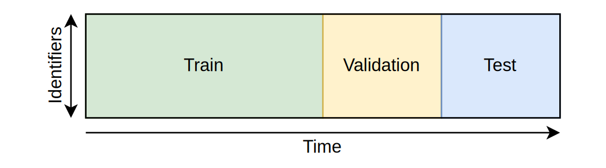
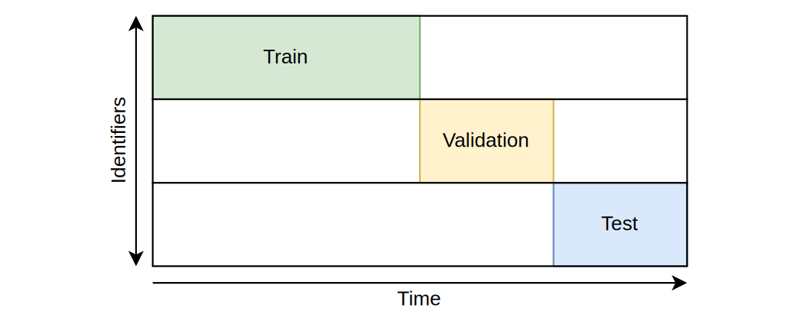
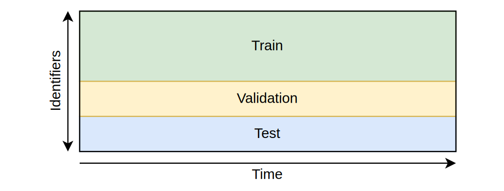

Currently `cesnet-tszoo` package offers three different approaches to working with data. Their main difference lies in how they divide data from datasets to train/val/test sets or how they load the data.

## [`TimeBasedCesnetDataset`][cesnet_tszoo.datasets.time_based_cesnet_dataset.TimeBasedCesnetDataset]
Time-based means batch size affects number of returned times in one batch and all sets have the same time series. Which time series are returned does not change. Additionally it supports sliding window.
Is configured with [`TimeBasedConfig`][cesnet_tszoo.configs.time_based_config.TimeBasedConfig].

## [`DisjointTimeBasedCesnetDataset`][cesnet_tszoo.datasets.disjoint_time_based_cesnet_dataset.DisjointTimeBasedCesnetDataset]
Disjoint-time-based means batch size affects number of returned times in one batch and each set can have different time series. Which time series are returned does not change. Additionally it supports sliding window.
Is configured with [`DisjointTimeBasedConfig`][cesnet_tszoo.configs.disjoint_time_based_config.DisjointTimeBasedConfig].

## [`SeriesBasedCesnetDataset`][cesnet_tszoo.datasets.series_based_cesnet_dataset.SeriesBasedCesnetDataset]
Series-based means batch size affects number of returned time series in one batch. Which times for each time series are returned does not change.
Is configured with [`SeriesBasedConfig`][cesnet_tszoo.configs.series_based_config.SeriesBasedConfig].

